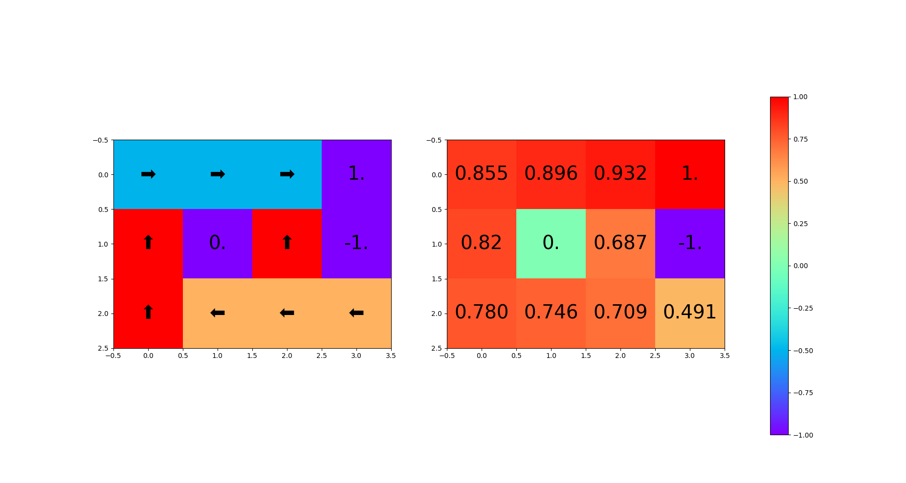
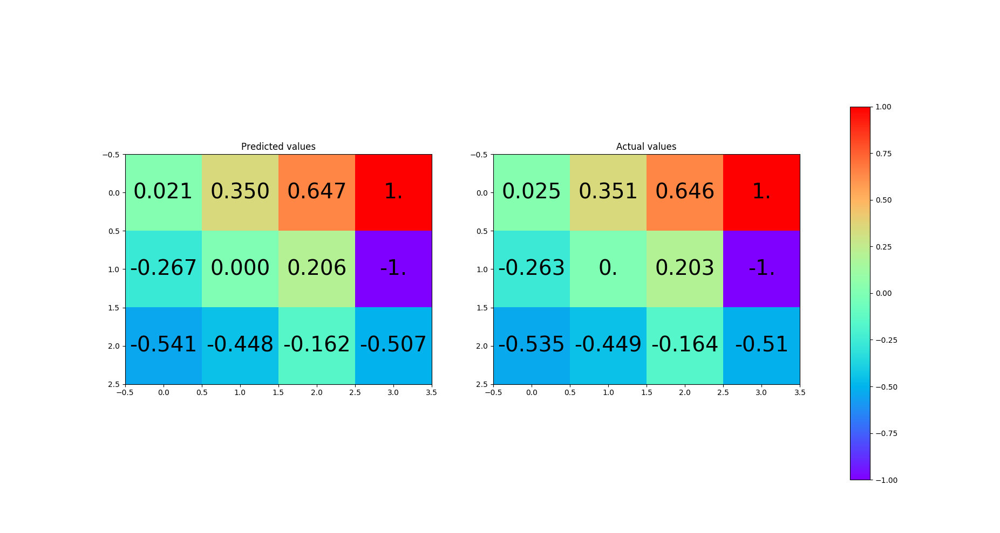

# Predicting-optimal-value-functions

Code accompanying paper "Predicting optimal value functions by interpolating reward functions in scalarized multi-objective reinforcement learing" published in ICRA 2020. 

Two different files are given: gridworld.py and gridworld_predict.py

Running gridworld.py with different living reward weights and terminal reward weights shows the optimal policy and optimal value functions 

*Figure 1 - Optimal policy and optimal value function using living reward weight=-0.02*

For calculating the prediction using Gaussian process and seeing the difference with actual, we run gridworld_predict.py

There are two flags for living reward weights and terminal reward weights which can be toggled.

For terminal reward weights, the reward and value functions are scaled to 1. 

*Figure 2 - Predicted and actual value functions for evaluation living reward weight=-0.23*
